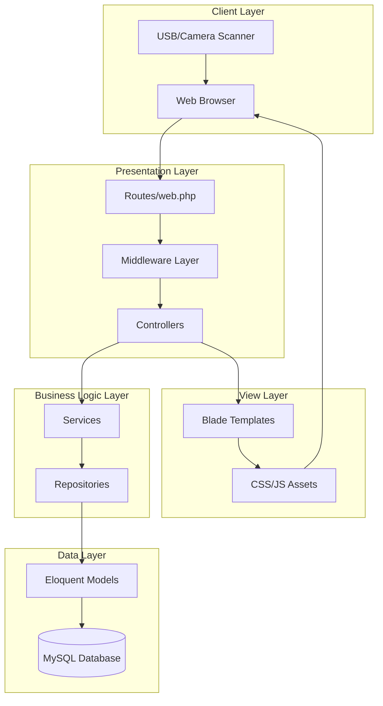
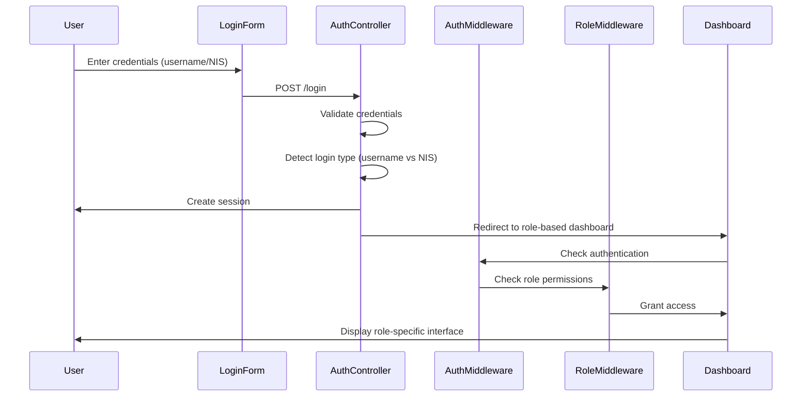
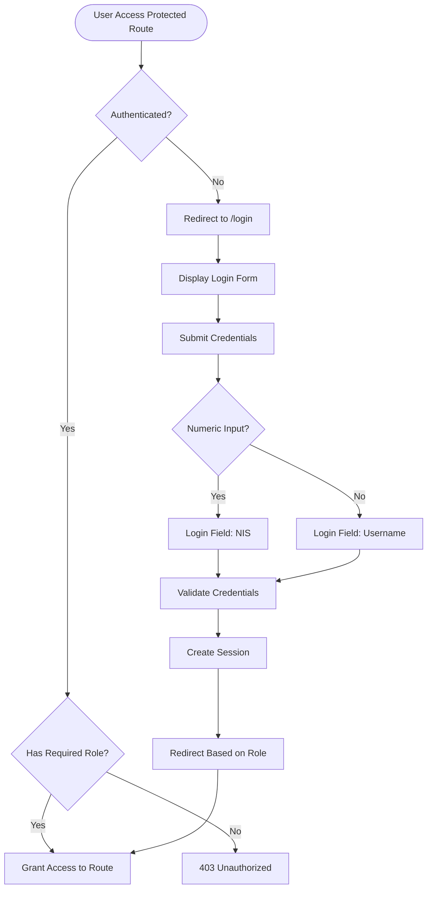

# 🏗️ ARTIKA POS - System Architecture

Complete technical documentation of ARTIKA POS system architecture, design patterns, and implementation details.

---

## 📋 Table of Contents

- [Overview](#overview)
- [Architecture Diagram](#architecture-diagram)
- [Directory Structure](#directory-structure)
- [Design Patterns](#design-patterns)
- [Authentication Flow](#authentication-flow)
- [Request Lifecycle](#request-lifecycle)
- [Database Layer](#database-layer)
- [Frontend Architecture](#frontend-architecture)
- [Security](#security)
- [Performance Optimization](#performance-optimization)

---

## Overview

ARTIKA POS dibangun menggunakan **Laravel 12** framework dengan arsitektur **MVC (Model-View-Controller)** yang diperkuat dengan **Service Layer** dan **Repository Pattern** untuk separation of concerns yang lebih baik.

### Tech Stack

- **Backend Framework:** Laravel 12 (PHP 8.2+)
- **Frontend:** Blade Templates + Bootstrap 5 + Custom SCSS
- **Database:** MySQL 5.7+ / MariaDB 10.3+
- **Asset Bundler:** Vite
- **Authentication:** Laravel's built-in auth dengan custom multi-field login
- **Session:** Database-driven sessions
- **Cache:** Database cache driver

---

## Architecture Diagram

### High-Level System Architecture



### Authentication & Authorization Flow



---

## Directory Structure

```
ARTIKA/
├── app/
│   ├── Http/
│   │   ├── Controllers/           # Request handlers
│   │   │   ├── AdminController.php
│   │   │   ├── AuthController.php
│   │   │   ├── PosController.php
│   │   │   ├── WarehouseController.php
│   │   │   ├── CategoryController.php
│   │   │   ├── CustomerController.php
│   │   │   └── UserController.php
│   │   └── Middleware/            # HTTP middleware
│   │       └── RoleMiddleware.php # Role-based access control
│   │
│   ├── Models/                    # Eloquent ORM models (16 models)
│   │   ├── User.php
│   │   ├── Role.php
│   │   ├── Product.php
│   │   ├── Category.php
│   │   ├── Transaction.php
│   │   ├── Stock.php
│   │   └── ...
│   │
│   ├── Services/                  # Business logic layer
│   │   └── TransactionService.php
│   │
│   ├── Repositories/              # Data access layer
│   │   ├── ProductRepository.php
│   │   └── TransactionRepository.php
│   │
│   ├── Interfaces/                # Repository interfaces
│   │   ├── ProductRepositoryInterface.php
│   │   └── TransactionRepositoryInterface.php
│   │
│   └── Providers/                 # Service providers
│       └── AppServiceProvider.php
│
├── bootstrap/
│   ├── app.php                    # Application bootstrap
│   └── cache/                     # Compiled files
│
├── config/                        # Configuration files
│   ├── app.php
│   ├── database.php
│   ├── auth.php
│   └── ...
│
├── database/
│   ├── migrations/                # Database schema (19 migrations)
│   └── seeders/                   # Database seeders
│       └── DatabaseSeeder.php
│
├── public/                        # Web server document root
│   ├── index.php                  # Application entry point
│   └── build/                     # Compiled assets (Vite)
│
├── resources/
│   ├── views/                     # Blade templates
│   │   ├── layouts/
│   │   │   └── app.blade.php     # Main layout
│   │   ├── auth/
│   │   │   └── login.blade.php   # Login page
│   │   ├── admin/                # Admin views
│   │   ├── pos/                  # POS views
│   │   └── warehouse/            # Warehouse views
│   │
│   ├── css/                       # SCSS/CSS files
│   └── js/                        # JavaScript files
│
├── routes/
│   ├── web.php                    # Web routes
│   └── console.php                # CLI routes
│
├── storage/                       # Application storage
│   ├── app/
│   ├── framework/
│   └── logs/
│
└── tests/                         # Application tests
```

---

## Design Patterns

### 1. MVC (Model-View-Controller)

**Classic Laravel MVC pattern:**

- **Models:** Eloquent ORM models representing database tables
- **Views:** Blade templates untuk presentation layer
- **Controllers:** Handle HTTP requests dan coordinate antara Models dan Views

**Example:**

```php
// Controller
class PosController extends Controller {
    public function index() {
        $products = Product::with('category', 'stocks')->get();
        return view('pos.index', compact('products'));
    }
}
```

### 2. Repository Pattern

**Purpose:** Abstraksi data access layer dari business logic

**Implementation:**

```php
// Interface
interface ProductRepositoryInterface {
    public function all();
    public function findByBarcode($barcode);
    public function create(array $data);
}

// Repository
class ProductRepository implements ProductRepositoryInterface {
    public function findByBarcode($barcode) {
        return Product::where('barcode', $barcode)->first();
    }
}

// Usage in Controller
class PosController extends Controller {
    protected $productRepo;

    public function __construct(ProductRepositoryInterface $productRepo) {
        $this->productRepo = $productRepo;
    }
}
```

**Benefits:**

- Decoupling dari Eloquent
- Easier testing (dapat mock repository)
- Centralized data access logic

### 3. Service Layer Pattern

**Purpose:** Encapsulate complex business logic

**Implementation:**

```php
class TransactionService {
    public function createTransaction(array $cartItems, array $paymentData) {
        DB::beginTransaction();
        try {
            // Create transaction
            $transaction = Transaction::create([...]);

            // Create transaction items
            foreach ($cartItems as $item) {
                TransactionItem::create([...]);
                // Update stock
                $this->updateStock($item);
            }

            // Create journal entry
            $this->createJournalEntry($transaction);

            DB::commit();
            return $transaction;
        } catch (Exception $e) {
            DB::rollBack();
            throw $e;
        }
    }
}
```

**Benefits:**

- Thin controllers
- Reusable business logic
- Transaction management
- Easier unit testing

### 4. Middleware Pattern

**Purpose:** Filter HTTP requests

**RoleMiddleware Example:**

```php
class RoleMiddleware {
    public function handle(Request $request, Closure $next, ...$roles) {
        if (!in_array($request->user()->role->name, $roles)) {
            abort(403, 'Unauthorized Access');
        }
        return $next($request);
    }
}
```

**Usage in Routes:**

```php
Route::middleware(['auth', 'role:admin'])->group(function () {
    Route::get('/admin/dashboard', [AdminController::class, 'index']);
});
```

---

## Authentication Flow

### Multi-Field Login System

ARTIKA POS supports **dual login** menggunakan `username` atau `NIS` (untuk kasir):

```php
// AuthController.php
public function login(Request $request) {
    $loginField = is_numeric($request->login) ? 'nis' : 'username';

    $credentials = [
        $loginField => $request->login,
        'password' => $request->password
    ];

    if (Auth::attempt($credentials)) {
        // Role-based redirection
        $role = Auth::user()->role->name;

        if ($role === 'admin') return redirect()->route('admin.dashboard');
        if ($role === 'cashier') return redirect()->route('pos.index');
        if ($role === 'warehouse') return redirect()->route('warehouse.dashboard');
    }

    return back()->withErrors(['login' => 'Invalid credentials']);
}
```

### Authentication Process Flow



---

## Request Lifecycle

### Typical POS Transaction Flow

```mermaid
sequenceDiagram
    participant Cashier
    participant Browser
    participant POSController
    participant TransactionService
    participant TransactionRepo
    participant Database

    Cashier->>Browser: Scan barcode / Add product
    Browser->>Browser: Update cart (client-side)

    Cashier->>Browser: Click checkout
    Browser->>POSController: POST /pos/checkout

    POSController->>POSController: Validate cart data
    POSController->>TransactionService: createTransaction(cart, payment)

    TransactionService->>Database: BEGIN TRANSACTION
    TransactionService->>TransactionRepo: create(transactionData)
    TransactionRepo->>Database: INSERT transactions

    loop For each cart item
        TransactionService->>Database: INSERT transaction_items
        TransactionService->>Database: UPDATE stocks (decrease quantity)
    end

    TransactionService->>Database: INSERT journals (accounting entry)
    TransactionService->>Database: COMMIT

    TransactionService-->>POSController: Return transaction
    POSController-->>Browser: Return success + receipt
    Browser-->>Cashier: Display receipt / Print

### Smart Scanner Implementation Logic

Sistem menggunakan `html5-qrcode` dengan logika tambahan untuk meningkatkan user experience:

1. **Anti-Spam Cooldown**: Menggunakan variabel `lastScannedBarcode` dan `lastScanTime`. Jika barcode yang sama terdeteksi dalam waktu < 2500ms, request diabaikan.
2. **Audio Feedback**: Menggunakan Web Audio API untuk generate `sine` wave frequency (1200Hz) sebagai suara "beep" sukses tanpa dependensi aset audio eksternal.
3. **Visual Feedback**: Kombinasi `flash` effect pada scanner overlay dan SweetAlert2 toast notification.
```

---

## Database Layer

### Eloquent ORM

ARTIKA POS menggunakan **Eloquent ORM** dengan relationships:

**Example Model dengan Relationships:**

```php
class Product extends Model {
    // Relationships
    public function category() {
        return $this->belongsTo(Category::class);
    }

    public function stocks() {
        return $this->hasMany(Stock::class);
    }

    public function transactionItems() {
        return $this->hasMany(TransactionItem::class);
    }

    // Accessors
    public function getFormattedPriceAttribute() {
        return 'Rp ' . number_format($this->price, 0, ',', '.');
    }

    // Scopes
    public function scopeInStock($query) {
        return $query->whereHas('stocks', function($q) {
            $q->where('quantity', '>', 0);
        });
    }
}
```

### Query Optimization

**Eager Loading untuk menghindari N+1 queries:**

```php
// Bad (N+1 problem)
$products = Product::all();
foreach ($products as $product) {
    echo $product->category->name; // 1 query per product
}

// Good (Eager loading)
$products = Product::with('category', 'stocks')->get(); // 2 queries total
```

---

## Frontend Architecture

### Blade Templates

**Layout Inheritance:**

```blade
{{-- layouts/app.blade.php --}}
<!DOCTYPE html>
<html>
<head>
    <title>@yield('title') - ARTIKA POS</title>
    @vite(['resources/css/app.css', 'resources/js/app.js'])
</head>
<body>
    @include('layouts.sidebar')

    <main class="content">
        @yield('content')
    </main>
</body>
</html>

{{-- pos/index.blade.php --}}
@extends('layouts.app')

@section('title', 'Point of Sale')

@section('content')
    <!-- POS Interface -->
@endsection
```

### Asset Management (Vite)

**vite.config.js:**

```javascript
export default defineConfig({
    plugins: [
        laravel({
            input: ["resources/css/app.css", "resources/js/app.js"],
            refresh: true,
        }),
    ],
});
```

**Benefits:**

- Hot Module Replacement (HMR)
- Fast build times
- Modern JavaScript support (ES modules)
- Automatic asset versioning

### Brown Theme Design System

**CSS Variables untuk consistency:**

```css
:root {
    --primary: #85695a;
    --accent: #c17a5c;
    --bg-light: #fdf8f6;
    --bg-cream: #f2e8e5;
    --text-dark: #2d2d2d;
}
```

---

## Security

### 1. Authentication & Authorization

- **bcrypt password hashing** (cost factor: 12)
- **Session-based authentication** (database driver)
- **Role-based access control** via middleware
- **CSRF protection** pada semua POST/PUT/DELETE requests

### 2. Input Validation

```php
$request->validate([
    'name' => 'required|string|max:255',
    'barcode' => 'required|unique:products',
    'price' => 'required|numeric|min:0',
]);
```

### 3. SQL Injection Protection

Eloquent ORM menggunakan **parameter binding** secara otomatis:

```php
// Safe (parameterized query)
Product::where('barcode', $request->barcode)->first();

// Avoid raw queries, atau gunakan bindings:
DB::select('SELECT * FROM products WHERE barcode = ?', [$barcode]);
```

### 4. XSS Protection

Blade templates **auto-escape output:**

```blade
{{ $product->name }}  <!-- Auto-escaped -->
{!! $html !!}         <!-- Raw HTML (use with caution) -->
```

---

## Performance Optimization

### 1. Database Indexing

```php
// Migration
$table->string('barcode')->unique(); // Indexed
$table->foreignId('category_id')->constrained(); // Foreign key indexed
```

### 2. Query Caching

```php
$categories = Cache::remember('categories', 3600, function () {
    return Category::all();
});
```

### 3. Eager Loading

```php
$products = Product::with(['category', 'stocks'])->get();
```

### 4. Asset Optimization

- **Vite** automatically minifies CSS/JS untuk production
- **Image optimization** menggunakan GD library
- **Asset versioning** untuk cache busting

---

## Extension Points

### Adding New Features

**1. Add New Role:**

```php
// Seeder
Role::create(['name' => 'manager', 'description' => 'Store Manager']);

// Middleware usage
Route::middleware(['role:manager'])->group(function () {
    // Manager routes
});
```

**2. Add New Payment Method:**

```php
// Seeder
PaymentMethod::create(['name' => 'Bank Transfer', 'slug' => 'bank-transfer']);
```

**3. Add New Report:**

```php
// Controller
public function salesReport(Request $request) {
    $sales = Transaction::whereBetween('created_at', [$start, $end])
        ->with('items.product')
        ->get();

    return view('admin.reports.sales', compact('sales'));
}
```

---

## Best Practices

### Code Organization

✅ **DO:**

- Keep controllers thin, move logic to services
- Use repositories untuk complex queries
- Use form requests untuk validation
- Follow PSR-12 coding standards
- Use type hints dan return types

❌ **DON'T:**

- Put business logic in controllers
- Use raw queries tanpa bindings
- Hardcode values (use config/env)
- Ignore N+1 query problems

### Testing

```php
// Feature test example
public function test_cashier_can_create_transaction() {
    $user = User::factory()->create(['role_id' => Role::CASHIER]);

    $response = $this->actingAs($user)
        ->post('/pos/checkout', [
            'items' => [...],
            'payment_method' => 'cash',
        ]);

    $response->assertStatus(200);
    $this->assertDatabaseHas('transactions', [...]);
}
```

---

## Related Documentation

- [DATABASE.md](file:///c:/laragon/www/ARTIKA/DATABASE.md) - Database schema details
- [API.md](file:///c:/laragon/www/ARTIKA/API.md) - API routes documentation
- [DEVELOPMENT.md](file:///c:/laragon/www/ARTIKA/DEVELOPMENT.md) - Development guide

---

**Last Updated:** 2026-01-23  
**Architecture Version:** 2.5
