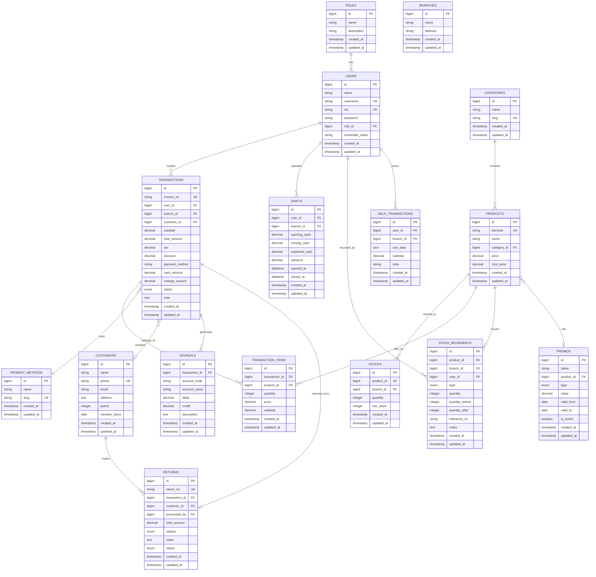

# 🗄️ ARTIKA POS - Database Documentation

Complete database schema documentation dengan Entity Relationship Diagrams (ERD) dan detail setiap tabel.

---

## 📋 Table of Contents

- [Overview](#overview)
- [Entity Relationship Diagram](#entity-relationship-diagram)
- [Tables Documentation](#tables-documentation)
- [Relationships](#relationships)
- [Indexes & Constraints](#indexes--constraints)
- [Seeded Data](#seeded-data)

---

## Overview

Database ARTIKA POS menggunakan **MySQL 5.7+** dengan **InnoDB storage engine**. Total terdapat **19 tabel utama** dengan foreign key constraints untuk data integrity.

### Database Configuration

```env
DB_CONNECTION=mysql
DB_HOST=127.0.0.1
DB_PORT=3306
DB_DATABASE=artika
DB_CHARACTER_SET=utf8mb4
DB_COLLATION=utf8mb4_unicode_ci
```

### Migration Files

Total: 19 migration files di `database/migrations/`

---

## Entity Relationship Diagram

### Core ERD - POS System



---

## Tables Documentation

### 1. `roles`

**Purpose:** User role definitions untuk role-based access control

| Column | Type | Nullable | Default | Description |
|--------|------|----------|---------|-------------|
| id | BIGINT UNSIGNED | NO | AUTO_INCREMENT | Primary key |
| name | VARCHAR(255) | NO | - | Role name (admin, cashier, warehouse) |
| description | VARCHAR(255) | YES | NULL | Role description |
| created_at | TIMESTAMP | YES | NULL | Created timestamp |
| updated_at | TIMESTAMP | YES | NULL | Updated timestamp |

**Indexes:**
- PRIMARY KEY (`id`)

---

### 2. `users`

**Purpose:** User accounts dengan multi-field authentication (username/NIS)

| Column | Type | Nullable | Default | Description |
|--------|------|----------|---------|-------------|
| id | BIGINT UNSIGNED | NO | AUTO_INCREMENT | Primary key |
| name | VARCHAR(255) | NO | - | User full name |
| username | VARCHAR(255) | NO | - | Login username |
| nis | VARCHAR(255) | YES | NULL | NIS untuk siswa/kasir (unique) |
| password | VARCHAR(255) | NO | - | Bcrypt hashed password |
| role_id | BIGINT UNSIGNED | YES | NULL | Foreign key ke roles |
| branch_id | BIGINT UNSIGNED | YES | NULL | Foreign key ke branches |
| remember_token | VARCHAR(100) | YES | NULL | Remember me token |
| created_at | TIMESTAMP | YES | NULL | Created timestamp |
| updated_at | TIMESTAMP | YES | NULL | Updated timestamp |

**Indexes:**
- PRIMARY KEY (`id`)
- UNIQUE KEY (`username`)
- UNIQUE KEY (`nis`)
- FOREIGN KEY (`role_id`) REFERENCES `roles(id)` ON DELETE SET NULL
- FOREIGN KEY (`branch_id`) REFERENCES `branches(id)` ON DELETE SET NULL

---

### 3. `branches`

**Purpose:** Store branches/cabang toko

| Column | Type | Nullable | Default | Description |
|--------|------|----------|---------|-------------|
| id | BIGINT UNSIGNED | NO | AUTO_INCREMENT | Primary key |
| name | VARCHAR(255) | NO | - | Branch name |
| address | TEXT | YES | NULL | Branch address |
| created_at | TIMESTAMP | YES | NULL | Created timestamp |
| updated_at | TIMESTAMP | YES | NULL | Updated timestamp |

**Indexes:**
- PRIMARY KEY (`id`)

---

### 4. `categories`

**Purpose:** Product categories

| Column | Type | Nullable | Default | Description |
|--------|------|----------|---------|-------------|
| id | BIGINT UNSIGNED | NO | AUTO_INCREMENT | Primary key |
| name | VARCHAR(255) | NO | - | Category name |
| slug | VARCHAR(255) | NO | - | URL-friendly slug |
| created_at | TIMESTAMP | YES | NULL | Created timestamp |
| updated_at | TIMESTAMP | YES | NULL | Updated timestamp |

**Indexes:**
- PRIMARY KEY (`id`)
- UNIQUE KEY (`slug`)

---

### 5. `products`

**Purpose:** Product catalog dengan barcode

| Column | Type | Nullable | Default | Description |
|--------|------|----------|---------|-------------|
| id | BIGINT UNSIGNED | NO | AUTO_INCREMENT | Primary key |
| barcode | VARCHAR(255) | NO | - | Product barcode (unique) |
| name | VARCHAR(255) | NO | - | Product name |
| category_id | BIGINT UNSIGNED | NO | - | Foreign key ke categories |
| price | DECIMAL(15,2) | NO | - | Selling price |
| cost_price | DECIMAL(15,2) | NO | - | Cost/purchase price |
| created_at | TIMESTAMP | YES | NULL | Created timestamp |
| updated_at | TIMESTAMP | YES | NULL | Updated timestamp |

**Indexes:**
- PRIMARY KEY (`id`)
- UNIQUE KEY (`barcode`)
- FOREIGN KEY (`category_id`) REFERENCES `categories(id)` ON DELETE CASCADE

---

### 6. `stocks`

**Purpose:** Inventory tracking per branch

| Column | Type | Nullable | Default | Description |
|--------|------|----------|---------|-------------|
| id | BIGINT UNSIGNED | NO | AUTO_INCREMENT | Primary key |
| product_id | BIGINT UNSIGNED | NO | - | Foreign key ke products |
| branch_id | BIGINT UNSIGNED | NO | - | Foreign key ke branches |
| quantity | INTEGER | NO | 0 | Current stock quantity |
| min_stock | INTEGER | NO | 10 | Minimum stock threshold |
| created_at | TIMESTAMP | YES | NULL | Created timestamp |
| updated_at | TIMESTAMP | YES | NULL | Updated timestamp |

**Indexes:**
- PRIMARY KEY (`id`)
- FOREIGN KEY (`product_id`) REFERENCES `products(id)` ON DELETE CASCADE
- FOREIGN KEY (`branch_id`) REFERENCES `branches(id)` ON DELETE CASCADE

**Business Logic:**
- Low stock alert when `quantity <= min_stock`

---

### 7. `customers`

**Purpose:** Customer database dengan loyalty points

| Column | Type | Nullable | Default | Description |
|--------|------|----------|---------|-------------|
| id | BIGINT UNSIGNED | NO | AUTO_INCREMENT | Primary key |
| name | VARCHAR(255) | NO | - | Customer name |
| phone | VARCHAR(20) | NO | - | Phone number (unique) |
| email | VARCHAR(255) | YES | NULL | Email address |
| address | TEXT | YES | NULL | Customer address |
| points | INTEGER | NO | 0 | Loyalty points |
| member_since | DATE | YES | NULL | Member registration date |
| created_at | TIMESTAMP | YES | NULL | Created timestamp |
| updated_at | TIMESTAMP | YES | NULL | Updated timestamp |

**Indexes:**
- PRIMARY KEY (`id`)
- UNIQUE KEY (`phone`)

---

### 8. `transactions`

**Purpose:** Sales transactions

| Column | Type | Nullable | Default | Description |
|--------|------|----------|---------|-------------|
| id | BIGINT UNSIGNED | NO | AUTO_INCREMENT | Primary key |
| invoice_no | VARCHAR(255) | NO | - | Auto-generated invoice number |
| user_id | BIGINT UNSIGNED | YES | NULL | Cashier/user who created |
| branch_id | BIGINT UNSIGNED | YES | NULL | Branch where transaction occurred |
| customer_id | BIGINT UNSIGNED | YES | NULL | Customer (optional) |
| subtotal | DECIMAL(15,2) | NO | - | Subtotal before tax/discount |
| total_amount | DECIMAL(15,2) | NO | - | Final total amount |
| tax | DECIMAL(15,2) | NO | 0 | Tax amount |
| discount | DECIMAL(15,2) | NO | 0 | Discount amount |
| payment_method | VARCHAR(255) | NO | - | Payment method used |
| cash_amount | DECIMAL(15,2) | YES | NULL | Cash received (for cash payments) |
| change_amount | DECIMAL(15,2) | YES | NULL | Change returned |
| status | ENUM | NO | pending | pending, completed, canceled |
| note | TEXT | YES | NULL | Transaction notes |
| created_at | TIMESTAMP | YES | NULL | Transaction timestamp |
| updated_at | TIMESTAMP | YES | NULL | Updated timestamp |

**Indexes:**
- PRIMARY KEY (`id`)
- UNIQUE KEY (`invoice_no`)
- FOREIGN KEY (`user_id`) REFERENCES `users(id)` ON DELETE SET NULL
- FOREIGN KEY (`branch_id`) REFERENCES `branches(id)` ON DELETE SET NULL
- FOREIGN KEY (`customer_id`) REFERENCES `customers(id)` ON DELETE SET NULL

**Invoice Format:** `INV-YYYYMMDD-XXXX` (e.g., INV-20260109-0001)

---

### 9. `transaction_items`

**Purpose:** Line items for each transaction

| Column | Type | Nullable | Default | Description |
|--------|------|----------|---------|-------------|
| id | BIGINT UNSIGNED | NO | AUTO_INCREMENT | Primary key |
| transaction_id | BIGINT UNSIGNED | NO | - | Foreign key ke transactions |
| product_id | BIGINT UNSIGNED | NO | - | Foreign key ke products |
| quantity | INTEGER | NO | - | Quantity sold |
| price | DECIMAL(15,2) | NO | - | Price per unit at time of sale |
| subtotal | DECIMAL(15,2) | NO | - | Line subtotal (quantity × price) |
| created_at | TIMESTAMP | YES | NULL | Created timestamp |
| updated_at | TIMESTAMP | YES | NULL | Updated timestamp |

**Indexes:**
- PRIMARY KEY (`id`)
- FOREIGN KEY (`transaction_id`) REFERENCES `transactions(id)` ON DELETE CASCADE
- FOREIGN KEY (`product_id`) REFERENCES `products(id)` ON DELETE CASCADE

---

### 10. `payment_methods`

**Purpose:** Available payment methods

| Column | Type | Nullable | Default | Description |
|--------|------|----------|---------|-------------|
| id | BIGINT UNSIGNED | NO | AUTO_INCREMENT | Primary key |
| name | VARCHAR(255) | NO | - | Payment method name |
| slug | VARCHAR(255) | NO | - | URL-friendly slug |
| created_at | TIMESTAMP | YES | NULL | Created timestamp |
| updated_at | TIMESTAMP | YES | NULL | Updated timestamp |

**Indexes:**
- PRIMARY KEY (`id`)
- UNIQUE KEY (`slug`)

**Default Values:** Cash, QRIS, Debit Card, Credit Card, E-Wallet

---

### 11. `held_transactions`

**Purpose:** Temporarily saved/parked transactions

| Column | Type | Nullable | Default | Description |
|--------|------|----------|---------|-------------|
| id | BIGINT UNSIGNED | NO | AUTO_INCREMENT | Primary key |
| user_id | BIGINT UNSIGNED | NO | - | User who saved the transaction |
| branch_id | BIGINT UNSIGNED | NO | - | Branch where saved |
| cart_data | JSON | NO | - | Serialized cart items |
| subtotal | DECIMAL(15,2) | NO | - | Cart subtotal |
| note | VARCHAR(255) | YES | NULL | Note/reason for holding |
| created_at | TIMESTAMP | YES | NULL | When transaction was held |
| updated_at | TIMESTAMP | YES | NULL | Updated timestamp |

**Indexes:**
- PRIMARY KEY (`id`)
- FOREIGN KEY (`user_id`) REFERENCES `users(id)` ON DELETE CASCADE
- FOREIGN KEY (`branch_id`) REFERENCES `branches(id)` ON DELETE CASCADE

---

### 12. `returns`

**Purpose:** Return/refund transactions

| Column | Type | Nullable | Default | Description |
|--------|------|----------|---------|-------------|
| id | BIGINT UNSIGNED | NO | AUTO_INCREMENT | Primary key |
| return_no | VARCHAR(255) | NO | - | Auto-generated return number |
| transaction_id | BIGINT UNSIGNED | YES | NULL | Original transaction |
| customer_id | BIGINT UNSIGNED | YES | NULL | Customer making return |
| processed_by | BIGINT UNSIGNED | YES | NULL | User who processed return |
| total_amount | DECIMAL(15,2) | NO | - | Refund amount |
| reason | ENUM | NO | - | defective, wrong_item, other |
| notes | TEXT | YES | NULL | Return notes |
| status | ENUM | NO | pending | pending, approved, rejected |
| created_at | TIMESTAMP | YES | NULL | Return timestamp |
| updated_at | TIMESTAMP | YES | NULL | Updated timestamp |

**Indexes:**
- PRIMARY KEY (`id`)
- UNIQUE KEY (`return_no`)
- FOREIGN KEY (`transaction_id`) REFERENCES `transactions(id)` ON DELETE SET NULL
- FOREIGN KEY (`customer_id`) REFERENCES `customers(id)` ON DELETE SET NULL
- FOREIGN KEY (`processed_by`) REFERENCES `users(id)` ON DELETE SET NULL

---

### 13. `shifts`

**Purpose:** Cashier shift management

| Column | Type | Nullable | Default | Description |
|--------|------|----------|---------|-------------|
| id | BIGINT UNSIGNED | NO | AUTO_INCREMENT | Primary key |
| user_id | BIGINT UNSIGNED | NO | - | Cashier user |
| branch_id | BIGINT UNSIGNED | NO | - | Branch |
| opening_cash | DECIMAL(15,2) | NO | - | Cash at shift open |
| closing_cash | DECIMAL(15,2) | YES | NULL | Cash at shift close |
| expected_cash | DECIMAL(15,2) | YES | NULL | Expected cash based on transactions |
| variance | DECIMAL(15,2) | YES | NULL | Difference (closing - expected) |
| opened_at | DATETIME | NO | - | Shift open time |
| closed_at | DATETIME | YES | NULL | Shift close time |
| created_at | TIMESTAMP | YES | NULL | Created timestamp |
| updated_at | TIMESTAMP | YES | NULL | Updated timestamp |

**Indexes:**
- PRIMARY KEY (`id`)
- FOREIGN KEY (`user_id`) REFERENCES `users(id)` ON DELETE CASCADE
- FOREIGN KEY (`branch_id`) REFERENCES `branches(id)` ON DELETE CASCADE

---

### 14. `journals`

**Purpose:** Accounting journal entries (double-entry bookkeeping)

| Column | Type | Nullable | Default | Description |
|--------|------|----------|---------|-------------|
| id | BIGINT UNSIGNED | NO | AUTO_INCREMENT | Primary key |
| transaction_id | BIGINT UNSIGNED | YES | NULL | Related transaction |
| account_code | VARCHAR(50) | NO | - | Chart of accounts code |
| account_name | VARCHAR(255) | NO | - | Account name |
| debit | DECIMAL(15,2) | NO | 0 | Debit amount |
| credit | DECIMAL(15,2) | NO | 0 | Credit amount |
| description | TEXT | YES | NULL | Entry description |
| created_at | TIMESTAMP | YES | NULL | Entry timestamp |
| updated_at | TIMESTAMP | YES | NULL | Updated timestamp |

**Indexes:**
- PRIMARY KEY (`id`)
- FOREIGN KEY (`transaction_id`) REFERENCES `transactions(id)` ON DELETE SET NULL

---

### 15. `promos`

**Purpose:** Promotions and discounts

| Column | Type | Nullable | Default | Description |
|--------|------|----------|---------|-------------|
| id | BIGINT UNSIGNED | NO | AUTO_INCREMENT | Primary key |
| name | VARCHAR(255) | NO | - | Promo name |
| product_id | BIGINT UNSIGNED | YES | NULL | Specific product (null = all) |
| type | ENUM | NO | - | percentage, fixed_amount |
| value | DECIMAL(15,2) | NO | - | Discount value |
| valid_from | DATE | NO | - | Start date |
| valid_to | DATE | NO | - | End date |
| is_active | BOOLEAN | NO | 1 | Active status |
| created_at | TIMESTAMP | YES | NULL | Created timestamp |
| updated_at | TIMESTAMP | YES | NULL | Updated timestamp |

**Indexes:**
- PRIMARY KEY (`id`)
- FOREIGN KEY (`product_id`) REFERENCES `products(id)` ON DELETE CASCADE

---

### 16. `stock_movements`

**Purpose:** Track all stock changes (audit trail)

| Column | Type | Nullable | Default | Description |
|--------|------|----------|---------|-------------|
| id | BIGINT UNSIGNED | NO | AUTO_INCREMENT | Primary key |
| product_id | BIGINT UNSIGNED | NO | - | Product |
| branch_id | BIGINT UNSIGNED | NO | - | Branch |
| user_id | BIGINT UNSIGNED | YES | NULL | User who made change |
| type | ENUM | NO | - | in, out, adjustment, transfer |
| quantity | INTEGER | NO | - | Quantity changed (positive/negative) |
| quantity_before | INTEGER | NO | - | Stock before movement |
| quantity_after | INTEGER | NO | - | Stock after movement |
| reference_no | VARCHAR(255) | YES | NULL | Reference (e.g., PO number) |
| notes | TEXT | YES | NULL | Movement notes |
| created_at | TIMESTAMP | YES | NULL | Movement timestamp |
| updated_at | TIMESTAMP | YES | NULL | Updated timestamp |

**Indexes:**
- PRIMARY KEY (`id`)
- FOREIGN KEY (`product_id`) REFERENCES `products(id)` ON DELETE CASCADE
- FOREIGN KEY (`branch_id`) REFERENCES `branches(id)` ON DELETE CASCADE
- FOREIGN KEY (`user_id`) REFERENCES `users(id)` ON DELETE SET NULL

---

## Relationships

### One-to-Many Relationships

- `roles` → `users` (1:N)
- `branches` → `users` (1:N)
- `branches` → `stocks` (1:N)
- `branches` → `transactions` (1:N)
- `categories` → `products` (1:N)
- `products` → `stocks` (1:N)
- `products` → `transaction_items` (1:N)
- `transactions` → `transaction_items` (1:N)
- `transactions` → `journals` (1:N)
- `users` → `transactions` (1:N)
- `users` → `shifts` (1:N)
- `users` → `held_transactions` (1:N)
- `customers` → `transactions` (1:N)
- `customers` → `returns` (1:N)

### Many-to-One Relationships

- `users` → `roles` (N:1)
- `users` → `branches` (N:1)
- `products` → `categories` (N:1)
- `stocks` → `products` (N:1)
- `stocks` → `branches` (N:1)
- `transactions` → `users` (N:1)
- `transactions` → `branches` (N:1)
- `transactions` → `customers` (N:1)

---

## Indexes & Constraints

### Unique Constraints

- `users.username` - Unique username
- `users.nis` - Unique NIS (for students/cashiers)
- `products.barcode` - Unique barcode
- `categories.slug` - Unique slug
- `payment_methods.slug` - Unique slug
- `transactions.invoice_no` - Unique invoice number
- `returns.return_no` - Unique return number
- `customers.phone` - Unique phone number

### Foreign Key Constraints

All foreign keys use:
- `ON DELETE CASCADE` - For dependent records (e.g., transaction_items)
- `ON DELETE SET NULL` - For references that can be orphaned (e.g., user_id in transactions)

---

## Seeded Data

Data yang di-seed oleh `DatabaseSeeder.php`:

### Roles (3)
```
- Admin (Full access)
- Cashier (POS access)
- Warehouse (Stock management access)
```

### Users (3)
```
- admin / password    (Admin)
- kasir1 / password   (Cashier, NIS: 12345)
- gudang / password   (Warehouse)
```

### Branches (2)
```
- Pusat
- Cabang 1
```

### Categories (5)
```
- Snack
- Drink
- Food
- Dairy
- Household
```

### Products (20)
Sample products across all categories dengan barcode format `899999XXXXXX`

Stock: Random 50-200 per product

### Customers (3)
```
- John Doe (100 points)
- Jane Smith (250 points)
- Bob Wilson (50 points)
```

### Payment Methods (5)
```
- Cash
- QRIS
- Debit Card
- Credit Card
- E-Wallet
```

---

## Database Operations

### Common Queries

**Get low stock products:**
```sql
SELECT p.name, s.quantity, s.min_stock, b.name as branch
FROM stocks s
JOIN products p ON s.product_id = p.id
JOIN branches b ON s.branch_id = b.id
WHERE s.quantity <= s.min_stock;
```

**Get sales by date range:**
```sql
SELECT DATE(created_at) as date, COUNT(*) as transactions, SUM(total_amount) as total_sales
FROM transactions
WHERE created_at BETWEEN '2026-01-01' AND '2026-01-31'
GROUP BY DATE(created_at);
```

**Get top selling products:**
```sql
SELECT p.name, SUM(ti.quantity) as total_sold
FROM transaction_items ti
JOIN products p ON ti.product_id = p.id
GROUP BY p.id
ORDER BY total_sold DESC
LIMIT 10;
```

---

## Backup & Maintenance

### Backup Command

```bash
mysqldump -u root -p artika > artika_backup_$(date +%Y%m%d).sql
```

### Restore Command

```bash
mysql -u root -p artika < artika_backup_20260109.sql
```

### Optimization

```sql
-- Analyze tables
ANALYZE TABLE products, stocks, transactions, transaction_items;

-- Optimize tables
OPTIMIZE TABLE products, stocks, transactions, transaction_items;
```

---

## Related Documentation

- [ARCHITECTURE.md](file:///c:/laragon/www/ARTIKA/ARCHITECTURE.md) - System architecture
- [API.md](file:///c:/laragon/www/ARTIKA/API.md) - API documentation

---

**Last Updated:** 2026-01-09  
**Schema Version:** 2.0
