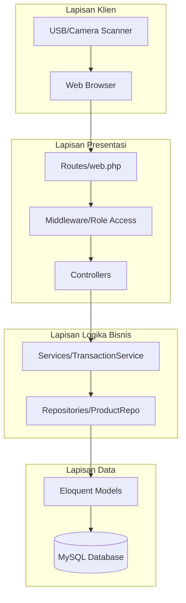

# 🏗️ Arsitektur Sistem ARTIKA POS

Dokumentasi teknis lengkap mengenai arsitektur sistem, pola desain (design patterns), dan detail implementas ARTIKA POS.

---

## 📋 Daftar Isi

- [Ringkasan](#ringkasan)
- [Diagram Arsitektur](#diagram-arsitektur)
- [Struktur Direktori](#struktur-direktori)
- [Pola Desain](#pola-desain)
- [Alur Autentikasi](#alur-autentikasi)
- [Siklus Hidup Request](#siklus-hidup-request)
- [Lapisan Keamanan](#lapisan-keamanan)

---

## Ringkasan

ARTIKA POS dibangun menggunakan framework **Laravel 12** (PHP 8.2+) dengan arsitektur **MVC (Model-View-Controller)** yang diperkuat dengan **Service Layer** dan **Repository Pattern** untuk pemisahan logika yang lebih baik dan kode yang lebih bersih.

---

## Diagram Arsitektur

Sistem mengikuti alur dari Client (Browser/Scanner) melalui routing, middleware, controller, hingga ke lapisan logika bisnis (Service/Repository) dan terakhir ke database.

---

## Pola Desain (Design Patterns)

### 1. MVC (Model-View-Controller)

Pola standar Laravel untuk memisahkan data (Model), tampilan (View), dan pengolah logika request (Controller).

### 2. Repository Pattern

Digunakan untuk mengabstraksi akses data dari logika bisnis. Hal ini memudahkan testing dan penggantian sumber data di masa depan.

- **Lokasi**: `app/Repositories/` dan `app/Interfaces/`

### 3. Service Layer Pattern

Digunakan untuk membungkus logika bisnis yang kompleks (seperti proses checkout transaksi yang melibatkan banyak tabel).

- **Lokasi**: `app/Services/`
- **Fitur Utama**: Menggunakan **Database Transactions** (`DB::transaction`) untuk menjamin integritas data.

### 4. Middleware Pattern

Digunakan untuk memfilter request masuk, terutama untuk pengecekan hak akses (Role-Based Access Control).

---

## Alur Autentikasi

ARTIKA mendukung login ganda:

1. **Username**: Untuk Admin dan petugas Gudang.
2. **NIS**: Untuk Kasir (siswa/staf).

Sistem secara otomatis mendeteksi input numerik sebagai NIS dan string sebagai Username.

---

## Keamanan

1. **Proteksi CSRF**: Semua request POST/PUT/DELETE dilindungi token CSRF.
2. **Hashing Password**: Menggunakan algoritma Bcrypt.
3. **Mencegah SQL Injection**: Menggunakan Eloquent ORM dengan parameter binding.
4. **XSS Protection**: Blade templates secara otomatis melakukan escaping pada output.

---

**Versi Arsitektur:** 2.5  
**Terakhir Diperbarui:** 2026-01-26
