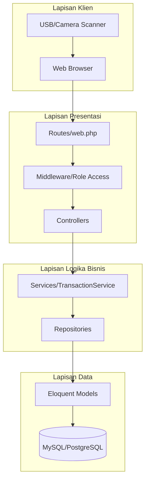

# 🏗️ Arsitektur Sistem ARTIKA POS

Dokumentasi teknis lengkap mengenai arsitektur sistem, pola desain (design patterns), dan detail implementas ARTIKA POS.

---

## 📋 Daftar Isi

- [Ringkasan](#ringkasan)
- [Diagram Arsitektur](#diagram-arsitektur)
- [Struktur Direktori](#struktur-direktori)
- [Pola Desain](#pola-desain)
- [Alur Autentikasi](#alur-autentikasi)
- [Siklus Hidup Request](#siklus-hidup-request)
- [Lapisan Keamanan](#lapisan-keamanan)

---

ARITKA POS dibangun menggunakan framework **Laravel 12** (PHP 8.2+) dengan arsitektur **MVC (Model-View-Controller)** yang diperkuat dengan **Service Layer** dan **Repository Pattern**.

---

## Diagram Arsitektur

---

## Lapisan Otorisasi (RBAC)

Sistem menggunakan Role-Based Access Control dengan 5 tingkatan:

1. **Superadmin**: Akses teknis tingkat tinggi (maintenance, logs, settings).
2. **Admin**: Pengelola utama operasional (master data, user, reports).
3. **Manager**: Pengawas harian (audit, koreksi transaksi, reports).
4. **Cashier**: Operator transaksi (POS, history).
5. **Warehouse**: Pengelola stok (opname, movements).

---

## Keamanan

1. **Proteksi CSRF**: Semua request POST/PUT/DELETE dilindungi token CSRF.
2. **Hashing Password**: Menggunakan algoritma Bcrypt via Laravel.
3. **Audit Logging**: Setiap aksi krusial (hapus data, update stok) dicatat dalam tabel `audit_logs` bersama data IP dan User-Agent.

---

**Versi Arsitektur:** 3.0  
**Terakhir Diperbarui:** 2026-02-12
